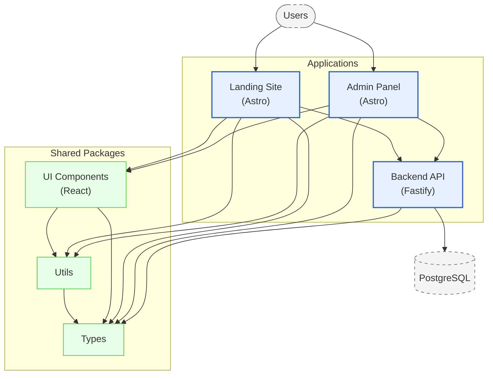

# NGT Martial Arts Club - Architecture Diagram

## User Flow and Dependencies

This diagram shows the system architecture:

1. **User Flow:**
   - Users interact with the Landing Site (public) or Admin Panel
   - Both applications communicate with the Backend API
   - The API connects exclusively to PostgreSQL database

2. **Package Dependencies (Bottom-Up):**
   - **Types**: Foundation package (no dependencies)
   - **Utils**: Builds on Types
   - **UI Components**: Uses both Types and Utils

3. **Application Dependencies:**
   - Frontend applications (Landing, Panel) use all shared packages
   - Backend API only uses Types package
